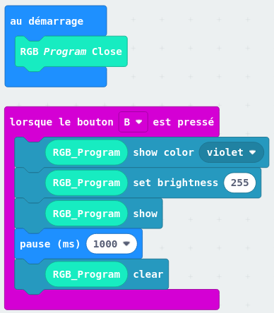

:doctitle: Jouer de la musique en lumière
:description: Utiliser le Piano:Bit pour jouer une mélodie
:keywords: microbit
:author: Gérald Quintana - MixTeen
:revdate: 2023-02-04
:category: Microbit
:teaser: Moyen
:imgteaser: micro-bit-piano-expansion-board-kubii.png

= Fiche 30: Jouer de la musique en lumière

Niveau: Moyen

Utiliser la carte d'extension Yahboom Piano
http://www.yahboom.net/study/piano_bit

== Blocs

* Entrée
** Lorsque le bouton ... pressé
* Piano
** Music Handle
** RGB Program Close et RGB_Program
* Neopixel
** Show color
** Set brightness
** Show

== Etape 0: Initialisation Piano:Bit

* Ajouter l'extension Piano:Bit
.. Rechercher *https://github.com/lzty634158/YB_Piano*
.. Sélectionner le paquet *Extension YahBoom YB_Piano*

== Etape 1: Souhaiter Joyeux anniversaire

* Lorsqu'on appuie sur le bouton A
** Jouer la mélodie *birthday*
** Afficher *Joyeux anniversaire*

== Etape 2: Allumer les bougies

* Faire clignoter les lumières en alternant les couleurs. 
  Pour allumer les lumières:
** Mettre un RGB Program Close au démarrage
** Choisir la couleur avec: RGB PRogram show color violet
** Choisir l'intensité avec: RGB PRogram set brightness 100 (maximum 255)
** Alumer avec: RGB Program show
** Eteindre avec: RGB Program clear

