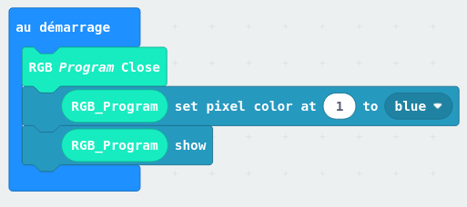

:doctitle: Jouer du piano
:description: Jouer du piano avec plusieurs octaves
:keywords: microbit
:author: Gérald Quintana - MixTeen
:revdate: 2023-02-04
:category: Difficile
:teaser: Moyen
:imgteaser: ../30_piano_anniversaire/micro-bit-piano-expansion-board-kubii.png

= Fiche 30: Jouer du piano

Niveau: Difficile

Utiliser la carte d'extension Yahboom Piano
http://www.yahboom.net/study/piano_bit

== Blocs

* Base
** Au démarrage / Toujours
** Montrer nombre
* Variable
** Définir V à 
** Lorsque le bouton ... pressé
* Piano
** Music Touch Return
** RGB Program Close et RGB_Program
** Play piano tone
* Neopixel
** Set pixel color at ... to ...
** Show

== Etape 0: Initialisation Ring:Bit

* Ajouter l'extension Piano:Bit
.. Rechercher *https://github.com/lzty634158/YB_Piano*
.. Sélectionner le paquet *Extension YahBoom YB_Piano*

== Etape 1: Répérer les codes touches

* Au démarrage
** Initialiser les 3 LEDs avec RGB Program Close
* Toujours
** Stocker la valeur Music touch return dans une variable `touche`
** Afficher le nombre `touche`

== Etape 2: Jouer du piano

* Toujours
** Ajouter un bloc Play piano 1
** Essayer avec differents nombre 2, 3...
* Au démarrage
** Allumer la LED 1 (en face du M) en bleu

== Etape 3: Régler l'octave

* Toujours
** Si `touche=L` alors
*** Mettre 1 dans la variable `octave`
*** Allumer la LED 0 (en face du L)
** Si `touche=M` alors
*** Mettre 2 dans la variable `octave`
*** Allumer la LED 1 (en face du M)
** Si `touche=H` alors
*** Mettre 3 dans la variable `octave`
*** Allumer la LED 2 (en face du H)
** Jouer du piano avec `octave`

== Etape 4: Fonction

Le bloc suivant est répéter 3 fois:

* Mettre X dans la variable `octave`
* Allumer la LED X 

On va le mettre dans un fonction

. Créer un fonction `reglerOctave` qui prend en paramètre un nombre,
mettre le bloc ci-dessus. 
. Appeler la fonction `reglerOctave` depuis le code principal
